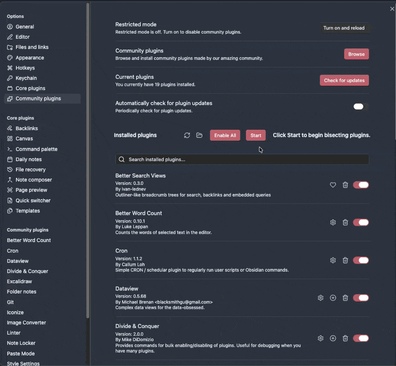

# ⚔️ Divide & Conquer


[](Changelog.md)

An [Obsidian](https://obsidian.md/) plugin that provides commands for bulk
enabling/disabling of plugins and CSS Snippets. This allows you to quickly
find which plugins are causing bugs or performance problems.


## How this helps with Debugging
You have a problem with Obsidian and have confirmed that the issue goes away
when enabling safe mode. Now, you have to narrow down which plugin misbehaves.
The most efficient method for doing so is called "bisecting", meaning that you
disable half of the plugins, and depending on whether the issue still occurs or
not, you can rule out one half of plugins.

Even though that process is the quickest method of finding the culprit-plugin,
it is still quite cumbersome for power users who have 40, 50 or more plugins.
*Divide & Conquer* provides some useful commands for bulk disabling/enabling of
plugins, to make the power user's life easier.

## Commands Added
For either Plugin/Snippet:
- Enable All - enable every plugin/snippet
- Bisect Start - begin the bisect process by enabling one half
and disabling the other
- Bisect Yes - issue is still present with the currently enabled half;
 keep narrowing this side
- Bisect No - issue is not present with the currently enabled half;
 eliminate that side and keep narrowing the remaining candidates

When only one possibility remains, DAC shows:
`The plugin possibly causing issues is: ...`
(or `CSS snippet` in snippet mode), then shows `Start` again.

(Note that to be able to fulfill its duty, this plugin will never disable
itself. The Hot Reload Plugin will also never be disabled, to avoid
interference for developers.)

## Settings
The plugin/snippet exclusion is
[regex](https://developer.mozilla.org/en-US/docs/Web/JavaScript/Guide/Regular_Expressions)
enabled, and you can exclude by author or description as well (e.g. 'command
palette' to exclude any plugins that modify the command palette)


## Installation
The plugin is available via Obsidian's Community Plugin Browser:
`Settings` → `Community Plugins` → `Browse` → Search for
*"Divide & Conquer"*

## Testing
- `tests/bisect.test.ts` covers the bisect user flow
(`Start`, `Yes`, `No`, `Enable All`) for plugins and CSS snippets.
- `tests/util.test.ts` covers utility behavior and UI-adjacent helper logic.
- Prefer user-visible test names that read like user action and outcomes.

## Development
- `npm run lint` — run all configured lint checks.
- `npm run lint:fix` — run all configured lint checks and apply available auto-fixes.

## Publishing

To publish a new release to the Obsidian community plugins, create a git tag
and push it to this remote repository.
This will trigger the GitHub Actions release workflow, which builds the plugin and
creates a GitHub release with the required files (`main.js`, `manifest.json`, `styles.css`).

```sh
git tag 1.0.0
git push origin 1.0.0
```

## Bugs
- Occasionally, for one reason or another (like updating plugins) a refresh
  won't be triggered by obsidian and the buttons may disappear. Clicking on
  the community plugins tab (or appearance if you're in snippets) triggers the
  refresh and the buttons reappear. You can also close and reoppen settings.

## Credits
- Currently maintained by [mikedidomizio](https://github.com/mikedidomizio)
- Originally created by [chrisgrieser](https://github.com/chrisgrieser/) aka
pseudometa, previously maintained by
[geoffreysflaminglasersword](https://github.com/geoffreysflaminglasersword).
